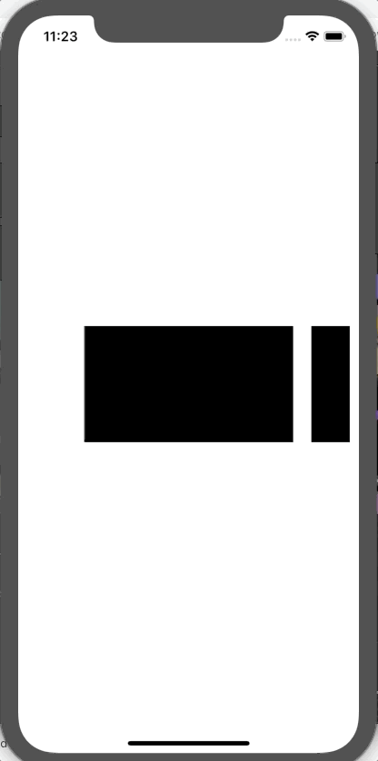

HorizontalCenteredCollectionView
===================
# Exaxmple

# Installation

## Manually

To integrate HorizontalCenteredCollectionView manually into your project, copy files from `CollectionView` folder into your Xcode project.

# Contribution
Feel free for forking and making pull requests. Create issues if you need some specific feature.

# License

HorizontalCenteredCollectionView is released under the Apache-2.0 license. See [LICENSE](https://github.com/leshchenko/HorizontalCenteredCollectionView/blob/master/LICENSE) for details.